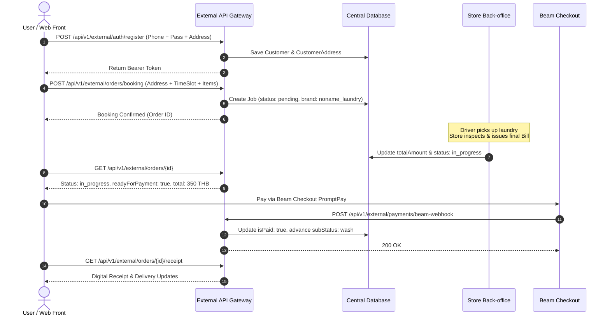

# Noname Laundry - REST API Specification (V1)
**Target Platform:** Online Laundry Web Application & CRM Integration  
**Backend System:** That Laundry Shop (TLS) Multi-Brand Engine  
**Version:** 1.0.0  
**Updated:** 2026-09-22  

---

## 1. Overview & Architecture

This REST API allows the **Noname Laundry** web application to integrate directly with the central Laundry ERP/CRM system. All customer records, addresses, and orders created via these endpoints are partitioned with `brand = 'noname_laundry'` and `sourceSystem = 'web_booking'`.

### Base URLs
| Environment | Base URL | Note |
| :--- | :--- | :--- |
| **Local Development** | `http://localhost:3000` | Local dev server (`npm run dev`) |
| **Cloud Run Test** | `https://tls-test-[hash].a.run.app` *(or your test domain)* | Branch `test` on GCP |
| **Production** | *(Provided upon production launch)* | Cloud Run Prod |

---

## 2. Authentication & Common Headers

All API requests require service-level authentication via an API Key. Endpoints that access customer-specific data additionally require a **Bearer JWT Token** obtained from the Login or Register endpoints.

### Request Headers
| Header | Value | Description |
| :--- | :--- | :--- |
| `Content-Type` | `application/json` | Required for all `POST` and `PUT` requests |
| `x-api-key` | `noname_secret_api_key_2026` | Service API Key for Noname Laundry integration |
| `x-brand` | `noname_laundry` | *(Optional, default: `noname_laundry`)* |
| `Authorization` | `Bearer <jwt_token>` | Required for authenticated customer endpoints |

---

## 3. End-to-End Customer Flow



---

## 4. API Endpoints

### 4.1 Authentication & Profile

#### 1. Register Customer (`POST /api/v1/external/auth/register`)
Registers a new customer under `noname_laundry`. Optionally creates the customer's primary address in the same transaction.

* **Headers:**
  * `Content-Type: application/json`
  * `x-api-key: noname_secret_api_key_2026`
* **Request Body:**
```json
{
  "name": "Alex Mercer",
  "phone": "0891112233",
  "password": "Password123!",
  "email": "alex.mercer@example.com",
  "nickName": "Alex",
  "gender": "Male",
  "address": {
    "label": "Home Condo",
    "placeName": "Ashton Asoke",
    "placeId": "ChIJb8W8k3Ge4jAR9...",
    "latitude": 13.736717,
    "longitude": 100.560633,
    "googleMapsUrl": "https://maps.google.com/?q=13.736717,100.560633",
    "address": "88 Sukhumvit 21, Khlong Toei Nuea, Watthana, Bangkok",
    "roomNumber": "2504",
    "subDistrict": "Khlong Toei Nuea",
    "district": "Watthana",
    "province": "Bangkok",
    "postalCode": "10110",
    "leaveWithJuristic": true,
    "deliveryNote": "Leave at juristic office tower A",
    "isPrimary": true
  }
}
```

* **Success Response (201 Created):**
```json
{
  "success": true,
  "message": "Customer registered successfully",
  "token": "eyJhbGciOiJIUzI1NiIsInR5cCI6IkpXVCJ9...",
  "customer": {
    "id": "cm...",
    "name": "ALEX MERCER",
    "nickName": "Alex",
    "phone": "0891112233",
    "email": "alex.mercer@example.com",
    "gender": "Male",
    "brand": "noname_laundry",
    "sourceSystem": "web_booking",
    "tier": "Regular",
    "addresses": [
      {
        "id": "cm_addr_123",
        "label": "Home Condo",
        "placeName": "Ashton Asoke",
        "address": "88 Sukhumvit 21, Khlong Toei Nuea, Watthana, Bangkok",
        "roomNumber": "2504",
        "latitude": 13.736717,
        "longitude": 100.560633,
        "isPrimary": true
      }
    ]
  }
}
```

* **cURL Example:**
```bash
curl -X POST "http://localhost:3000/api/v1/external/auth/register" \
  -H "Content-Type: application/json" \
  -H "x-api-key: noname_secret_api_key_2026" \
  -d '{
    "name": "Alex Mercer",
    "phone": "0891112233",
    "password": "Password123!",
    "nickName": "Alex",
    "gender": "Male"
  }'
```

---

#### 2. Customer Login (`POST /api/v1/external/auth/login`)
Authenticates a customer by phone and password. Returns a Bearer JWT Token valid for 30 days.

* **Request Body:**
```json
{
  "phone": "0891112233",
  "password": "Password123!"
}
```

* **Success Response (200 OK):**
```json
{
  "success": true,
  "token": "eyJhbGciOiJIUzI1NiIsInR5cCI6IkpXVCJ9...",
  "customer": {
    "id": "cm...",
    "name": "ALEX MERCER",
    "nickName": "Alex",
    "phone": "0891112233",
    "email": "alex.mercer@example.com",
    "brand": "noname_laundry",
    "addresses": []
  }
}
```

---

#### 3. Get Profile (`GET /api/v1/external/profile`)
Retrieves the profile and saved addresses of the authenticated customer.

* **Headers:**
  * `x-api-key: noname_secret_api_key_2026`
  * `Authorization: Bearer <jwt_token>`

* **Success Response (200 OK):**
```json
{
  "success": true,
  "customer": {
    "id": "cm...",
    "name": "ALEX MERCER",
    "nickName": "Alex",
    "phone": "0891112233",
    "email": "alex.mercer@example.com",
    "gender": "Male",
    "secondaryPhone": "0819998877",
    "isSecondaryWhatsapp": true,
    "brand": "noname_laundry",
    "addresses": [...]
  }
}
```

---

#### 4. Update Profile (`PUT /api/v1/external/profile`)
Updates customer profile details.

* **Request Body:**
```json
{
  "nickName": "Alex M.",
  "gender": "Male",
  "secondaryPhone": "0819998877",
  "isSecondaryWhatsapp": true
}
```

---

### 4.2 Address Book Management

#### 1. List Addresses (`GET /api/v1/external/addresses`)
Returns all saved addresses for the logged-in customer.

* **Headers:**
  * `Authorization: Bearer <jwt_token>`
  * `x-api-key: noname_secret_api_key_2026`

* **Success Response (200 OK):**
```json
{
  "success": true,
  "addresses": [
    {
      "id": "addr_abc123",
      "label": "Home Condo",
      "placeName": "Ashton Asoke",
      "latitude": 13.736717,
      "longitude": 100.560633,
      "address": "88 Sukhumvit 21, Khlong Toei Nuea, Watthana, Bangkok",
      "roomNumber": "2504",
      "leaveWithJuristic": true,
      "deliveryNote": "Drop at Juristic counter",
      "isPrimary": true
    }
  ]
}
```

---

#### 2. Create Address (`POST /api/v1/external/addresses`)
Adds a new address to the customer's address book.

* **Request Body:**
```json
{
  "label": "Office",
  "placeName": "GMM Grammy Place",
  "latitude": 13.7431,
  "longitude": 100.5632,
  "googleMapsUrl": "https://maps.app.goo.gl/example",
  "address": "50 Sukhumvit 21, Khlong Toei Nuea, Watthana, Bangkok",
  "roomNumber": "Floor 18",
  "subDistrict": "Khlong Toei Nuea",
  "district": "Watthana",
  "province": "Bangkok",
  "postalCode": "10110",
  "contactName": "Alex Mercer",
  "contactPhone": "0891112233",
  "leaveWithJuristic": false,
  "deliveryNote": "Call upon arrival",
  "isPrimary": false
}
```

---

#### 3. Update Address (`PUT /api/v1/external/addresses`)
* **Request Body:**
```json
{
  "id": "addr_abc123",
  "roomNumber": "2508",
  "deliveryNote": "New room number, please leave at door",
  "isPrimary": true
}
```

---

#### 4. Delete Address (`DELETE /api/v1/external/addresses?id=<address_id>`)
Deletes an address from the address book.

---

### 4.3 Laundry Orders & Bookings

#### 1. Create Booking (`POST /api/v1/external/orders/booking`)
Submits a laundry booking request. Automatically creates a Job in the POS system with status `pending`.

* **Request Body:**
```json
{
  "addressId": "addr_abc123",
  "scheduledDate": "2026-09-25",
  "timeSlot": "10:00 - 12:00",
  "servicePreferences": ["wash_fold", "dry_cleaning"],
  "customerNote": "Please separate white shirts and use mild softener",
  "leaveWithJuristic": true
}
```

* **Success Response (201 Created):**
```json
{
  "success": true,
  "message": "Booking confirmed successfully",
  "order": {
    "id": "cm...",
    "status": "pending",
    "scheduledAt": "2026-09-25T03:00:00.000Z",
    "timeSlot": "10:00 - 12:00",
    "pickupLocation": "Ashton Asoke, Room 2504, 88 Sukhumvit 21...",
    "brand": "noname_laundry",
    "createdAt": "2026-09-22T08:00:00.000Z"
  }
}
```

---

#### 2. List Orders (`GET /api/v1/external/orders`)
Returns all orders belonging to the authenticated customer.

* **Query Parameters:**
  * `limit` (optional, default: `20`)
  * `page` (optional, default: `1`)
  * `status` (optional, e.g. `pending`, `in_progress`, `completed`, `all`)

---

#### 3. Get Order Details (`GET /api/v1/external/orders/{id}`)
Retrieves comprehensive details of an order, including status, laundry items, pricing breakdown, payment readiness, driver assignment, and delivery proof photos.

* **Success Response (200 OK):**
```json
{
  "success": true,
  "order": {
    "id": "cm_job_123456",
    "billNo": "NN-202609-0012",
    "brand": "noname_laundry",
    "status": "in_progress",
    "subStatus": "wash",
    "serviceType": "wash_fold",
    "customerName": "ALEX MERCER",
    "customerPhone": "0891112233",
    "pickupLocation": "Ashton Asoke, Room 2504",
    "dropoffLocation": "That Laundry Shop (Central)",
    "scheduledAt": "2026-09-25T10:00:00.000Z",
    "items": [
      {
        "name": "Wash & Fold (Bag)",
        "quantity": 2,
        "price": 150,
        "total": 300
      },
      {
        "name": "Dry Clean Suit",
        "quantity": 1,
        "price": 250,
        "total": 250
      }
    ],
    "totalAmount": 550,
    "deliveryFee": 0,
    "discount": 0,
    "isPaid": false,
    "readyForPayment": true,
    "paymentMethod": null,
    "paymentChannel": null,
    "remark": "[Noname Web Booking] TimeSlot: 10:00 - 12:00",
    "bagImageUrl": "https://storage.googleapis.com/.../bag_photo.jpg",
    "deliveryProofImageUrl": null,
    "createdAt": "2026-09-22T08:00:00.000Z",
    "updatedAt": "2026-09-22T08:30:00.000Z"
  }
}
```

---

#### 4. Get Digital Receipt (`GET /api/v1/external/orders/{id}/receipt`)
Returns formatted digital receipt data once the order is paid (`isPaid = true`).

* **Success Response (200 OK):**
```json
{
  "success": true,
  "receipt": {
    "storeName": "Noname Laundry",
    "tagline": "Online Laundry & Dry Clean Service",
    "website": "https://nonamelaundry.com",
    "receiptNumber": "NN-202609-0012",
    "orderId": "cm_job_123456",
    "customerName": "ALEX MERCER",
    "customerPhone": "0891112233",
    "deliveryAddress": "Ashton Asoke, Room 2504",
    "items": [
      {
        "name": "Wash & Fold (Bag)",
        "quantity": 2,
        "price": 150,
        "total": 300
      }
    ],
    "subtotal": 300,
    "deliveryFee": 0,
    "discount": 0,
    "totalAmount": 300,
    "paymentChannel": "Beam Checkout (PromptPay)",
    "paidAt": "2026-09-25T11:00:00.000Z",
    "status": "PAID"
  }
}
```

---

### 4.4 Payment Gateway Webhook (Beam Checkout)

#### Beam Webhook Endpoint (`POST /api/v1/external/payments/beam-webhook`)
Receives automated payment confirmation webhooks from **Beam Checkout**.

* **Headers:**
  * `Content-Type: application/json`
  * `x-beam-signature: <hex-hmac-sha256>` *(Signature calculated with `BEAM_WEBHOOK_SECRET`)*
* **Request Payload (Example):**
```json
{
  "event": "charge.succeeded",
  "data": {
    "reference_id": "cm_job_123456",
    "transaction_id": "beam_ch_99887766",
    "amount": 300.00,
    "currency": "THB",
    "payment_method": "promptpay",
    "paid_at": "2026-09-25T11:00:00Z"
  }
}
```

* **Automatic Actions Performed by Backend:**
  1. Validates HMAC-SHA256 signature using `BEAM_WEBHOOK_SECRET`.
  2. Locates order by `reference_id` (Job ID).
  3. Sets `isPaid = true` and `isShopPaid = true`.
  4. Records `paymentChannel = 'beam_promptpay'` and `paymentMethod = 'Beam Checkout'`.
  5. Automatically advances `subStatus` from billing to **`wash`** (washing in progress).
  6. Appends payment receipt history to `adminNotesJson` for back-office auditing.

* **Response:**
```json
{
  "success": true,
  "message": "Order cm_job_123456 marked as paid via Beam and advanced to wash",
  "orderId": "cm_job_123456",
  "totalAmount": 300
}
```

---

## 5. Order Status & Lifecycle Reference

### Status (`job.status`)
* `pending`: Booking received; awaiting driver pickup.
* `in_progress`: Laundry picked up and currently at the facility (washing, drying, ironing).
* `completed`: Clean laundry delivered back to customer.
* `cancelled`: Booking cancelled.

### Sub-Status (`job.subStatus`)
* `pickup_pending`: Waiting for rider assignment to pick up.
* `in_store`: Laundry arrived at central processing center.
* `wash`: Washing / Dry cleaning underway.
* `dry`: Drying in tumble dryer.
* `iron`: Ironing / Folding.
* `pack`: Quality check and packaging.
* `delivery_pending`: Ready for delivery rider pickup.
* `delivering`: Rider on the way to customer condo.
* `delivered`: Completed delivery.
